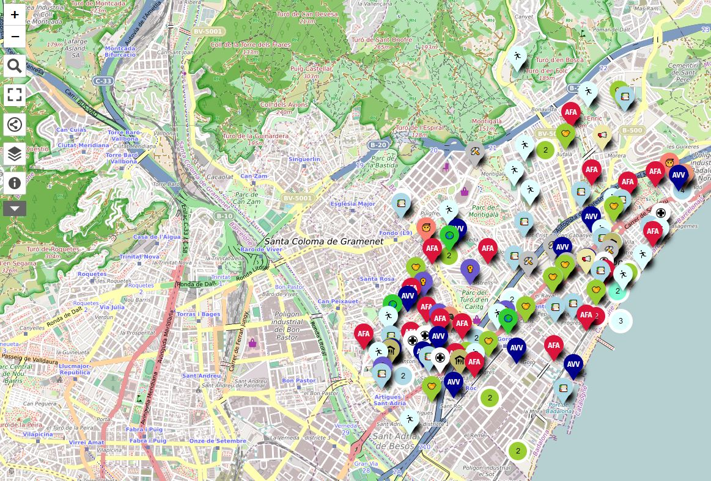

# Introducció

El [mapa d'entitats a Badalona](https://umap.openstreetmap.fr/ca/map/entitats-actives-de-badalona_1027376#14/41.4554/2.2576) forma part d'un [projecte ciutadà](https://github.com/ProjEntBdn/repositori_central) per millorar la informació disponible de les entitats actives a Badalona.

# Ús del mapa

Es pot utilitzar el cursor per veure el nom de l'entitat sense haver de fer clic i, una vegada s'hagi trobat la que es vol veure, es pot fer clic per veure la seva fitxa.

## Capes

En el mapa, a l'esquerra, hi ha una icona que permet filtrar el llistat d'entitats per nom i per tipus, a més d'ocultar o mostrar capes per facilitar la cerca.

En fer clic sobre aquesta icona, es pot fer clic sobre el filtre per buscar una entitat pel seu nom o filtrar per les que es troben actualment visibles.

També es poden ocultar/mostrar capes (tipus d'entitats) fent clic sobre la icona que sembla un ull (resaltada amb vermell) a l'esquerra del tipus d'entitat, o veure el llistat d'entitats a cada capa tenint en compte el filtre, si n'hi ha algun, fent clic sobre la fletxa (resaltada amb blau).

## Informació

A sota del botó anterior, podem trobar...

En el panell que s'obre, a sota de tot, es pot fer clic sobre els crèdits per consultar-los.

## Idioma

El servei [uMap](https://umap.openstreetmap.fr/ca/) utilitzat per fer el mapa es troba disponible en diversos [idiomes](https://wiki.openstreetmap.org/wiki/UMap). Es pot escollir l'idioma de la interfície canviant la URL del mapa, per exemple, [ca](https://umap.openstreetmap.fr/ca/map/entitats-actives-de-badalona_1027376#14/41.4554/2.2576) pel català, [es](https://umap.openstreetmap.fr/es/map/entitats-actives-de-badalona_1027376#14/41.4554/2.2576) pel castellà o [en](https://umap.openstreetmap.fr/en/map/entitats-actives-de-badalona_1027376#14/41.4554/2.2576) per l'anglès.

El que no es pot escollir és l'idioma de les fitxes de les entitats. Com que la major part de la informació s'ha obtingut de fonts oficials i es troba en català, de moment, la informació només es troba disponible en català.
